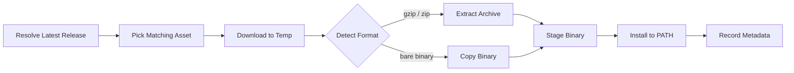

# gh-install-from

A GitHub CLI extension to install binaries from GitHub releases. It automatically detects the appropriate binary for your OS and architecture, handles compressed files, and manages updates.

> Maintained by [Martyn Messerli](https://github.com/realloser)

## ⚠️ Security Notice

This tool helps you download and install binaries from GitHub releases. Please note:

- **No Binary Verification**: While this tool itself undergoes security scanning, it **does not** verify the security or authenticity of the binaries you install
- **Content-based Detection**: Formats are detected by content (gzip/zip vs bare binary), not by filename
- **Trust Required**: You should only install binaries from repositories and authors you trust
- **Your Responsibility**: Always verify the source and reputation of repositories before installing their binaries
- **Recommended Practices**:
  - Check the repository's security practices
  - Verify release signatures if available
  - Review the repository's security advisories
  - Consider using package managers for well-known software

## How It Works

`gh-install-from` resolves the latest release for a repository, picks the asset
that matches your OS and architecture (falling back to a single plain-name asset
for bare binaries), downloads it, and detects the file format by content rather
than by filename:



## Why Use This Tool?

### For Individual Users
- 🔍 **Automatic Detection**: Automatically finds the right binary for your system
- 📦 **Compression Support**: Handles .tar.gz, .tgz, .zip files, and bare binaries
- 🔄 **Version Management**: Easy updates and version tracking
- 📊 **User Experience**: Progress bars and detailed logging
- 🚀 **Cross-Platform**: Works on macOS, Linux, and Windows

### For Enterprises
- 🔒 **GitHub Enterprise Support**: Works seamlessly with [GitHub Enterprise](https://github.com/enterprise)
- 📝 **Audit Trail**: Maintains detailed installation records
- 🔐 **Security**: Implements enterprise-grade security measures
- 🏢 **Internal Tools**: Perfect for distributing internal tools via GitHub releases
- 📋 **Compliance**: Supports enterprise security policies and version control

### Why Not Use Package Managers?
While package managers like [Homebrew](https://brew.sh), [winget](https://learn.microsoft.com/en-us/windows/package-manager/winget/), or [apt](https://wiki.debian.org/Apt) are great for public software, they have limitations:
- Internal tools can't be published to public repositories
- Enterprise tools often can't be shared publicly
- Custom builds need to be distributed securely
- Version control is more complex
- Approval processes can be lengthy

`gh-install-from` solves these issues by:
- Installing directly from GitHub releases
- Supporting private repositories
- Working with GitHub Enterprise
- Maintaining version history
- Providing audit trails

## Features

- 🔍 Automatic OS and architecture detection
- 📦 Support for compressed files (.tar.gz, .tgz, .zip) and bare binaries
- 🔄 Version management and updates
- 📊 Progress bar for downloads
- 🚀 Multi-platform build support
- 🔒 Security scanning of gh-install-from itself
- 🛠️ Parallel builds for faster releases
- 📝 Detailed logging with verbose mode
- 🔑 Uses GitHub CLI's authentication

## Prerequisites

- [GitHub CLI](https://cli.github.com/) (`gh`) installed and authenticated

## Installation

```bash
gh extension install realloser/gh-install-from
```

## Usage

Install a binary from a GitHub repository:
```bash
gh install-from owner/repo
```

Example using ripgrep:
```bash
gh install-from BurntSushi/ripgrep
```

### Setup (PATH)

Binaries are installed to `~/.gh-install-from/bin` (or `$GH_INSTALL_FROM_HOME/bin` if set). Add this directory to your PATH:

```bash
# Add to PATH (run once)
gh install-from init
```

Or manually add to your shell config:
- **Bash/Zsh**: `export PATH="$HOME/.gh-install-from/bin:$PATH"`
- **Fish**: `set -U fish_user_paths $HOME/.gh-install-from/bin $fish_user_paths`

Check if PATH is configured:
```bash
gh install-from doctor
```

### Commands

| Command | Description |
|---------|-------------|
| `gh install-from [owner/repo]` | Install a binary |
| `gh install-from list` | List installed binaries |
| `gh install-from update` | Update binaries that have new versions |
| `gh install-from outdated` | List binaries with available updates |
| `gh install-from remove [name\|repo]` | Remove an installed binary |
| `gh install-from init` | Add bin directory to PATH (idempotent) |
| `gh install-from doctor` | Check PATH configuration |
| `gh install-from versions [owner/repo]` | Browse and select versions |

### Options

- `--version, -v`: Print version information
- `--no-version-check`: Disable automatic version check
- `--verbose, -V`: Enable verbose output with detailed logging
- `--remove-quarantine`: Strip the macOS quarantine attribute after install without prompting (macOS only; see [macOS Quarantine Handling](#macos-quarantine-handling))

### macOS Quarantine Handling

On macOS, binaries downloaded from GitHub releases may carry a `com.apple.quarantine` extended attribute, which causes Gatekeeper to block execution ("cannot be opened because the developer cannot be verified").

After installing a binary, `gh-install-from` detects whether Gatekeeper blocked it by running the binary with a safe no-op flag (`--help`/`-h`/`--version`). If a quarantine block is detected:

- **Interactive (terminal):** you are prompted to remove the quarantine attribute now (`[y/N]`). The attribute is stripped only if you confirm.
- **Non-interactive (CI / no TTY):** no prompt; a guidance message is printed instead.
- **`--remove-quarantine` flag:** strips the attribute without prompting — useful for scripts and CI that want to auto-strip.

Stripping **never** happens without explicit confirmation (the interactive prompt or the flag). Detection is advisory and never aborts the install.

To remove the attribute manually:
```bash
xattr -d com.apple.quarantine <path-to-binary>
```
or approve the binary in **System Settings > Privacy & Security > Security**.

### Configuration

| Environment Variable | Description |
|---------------------|-------------|
| `GH_INSTALL_FROM_HOME` | Root directory (default: `~/.gh-install-from`) |
| `GH_INSTALL_FROM_CLIENT` | GitHub client adapter (default: `gh`) |
| `GH_INSTALL_FROM_STORE` | Metadata store adapter (default: `json`) |
| `GH_INSTALL_FROM_SHELL` | Shell for `init` command (default: auto-detect) |

### Verbose Mode

When using the `--verbose` flag, the tool will output detailed information about:
- Binary detection and selection
- Download progress and file operations
- Version checking and updates
- Installation paths and file operations

Example with verbose output:
```bash
gh install-from --verbose BurntSushi/ripgrep
```

## Supported Platforms

- macOS (amd64, arm64)
- Linux (386, amd64, arm, arm64)
- Windows (386, amd64)

## Contributing

Contributions are welcome! See [CONTRIBUTING.md](CONTRIBUTING.md) for development setup,
testing, linting, CI/CD details, and the release process.

## License

MIT License - see LICENSE file for details 